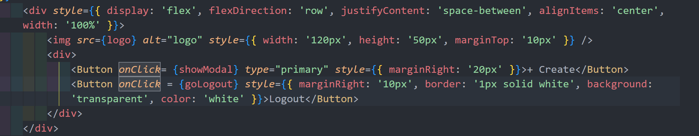
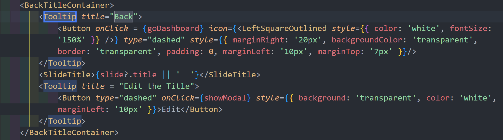
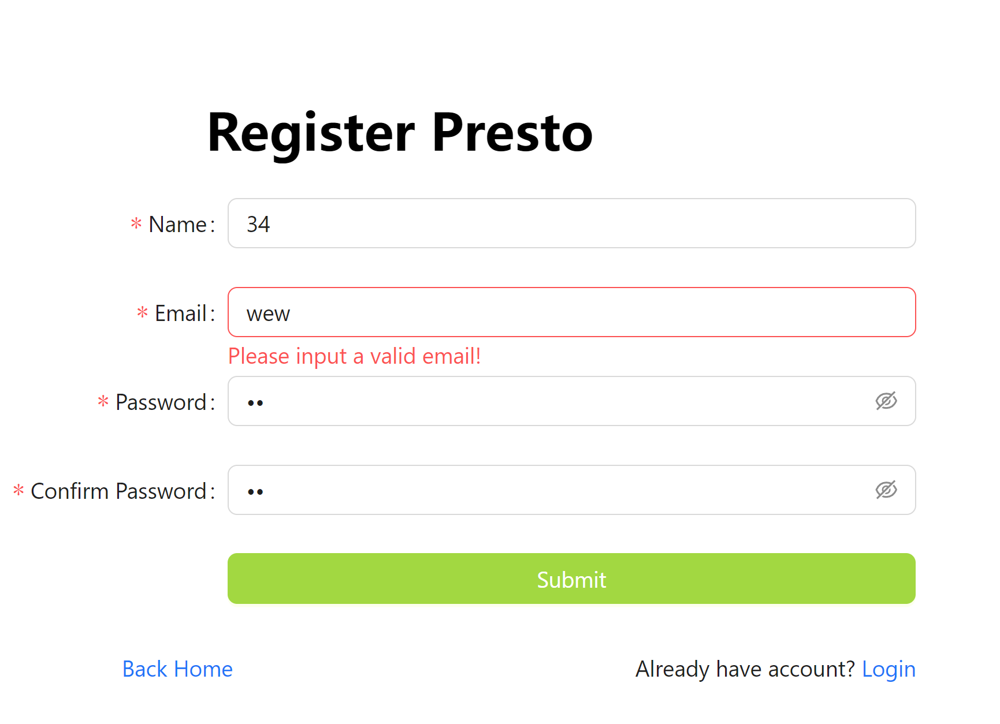
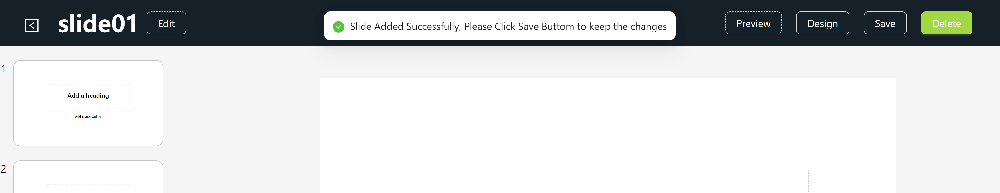

In this project, I have taken the following measures to improve the accessibility of the application:

1. Added alt attribute to all images, making it easier for screen readers to read image content.

   
2. In the editing page, Tooltips have been added for the return button, preview button, save button, etc., making it easier for users to understand the functions of the buttons.

   
3. On the login and registration pages, placeholder prompt text has been added to the form input box to guide users in their input. At the same time, verification rules and error prompts have been added for mandatory fields to ensure the accuracy of user input.

   
4. The page structure is clear and uses semantic HTML tags, making it easy for screen readers to parse page content.
5. When loading data or submitting a form or save any slide change, a loading prompt will be given, and a success or failure message feedback will pop up after completion to enhance the user experience.

   
