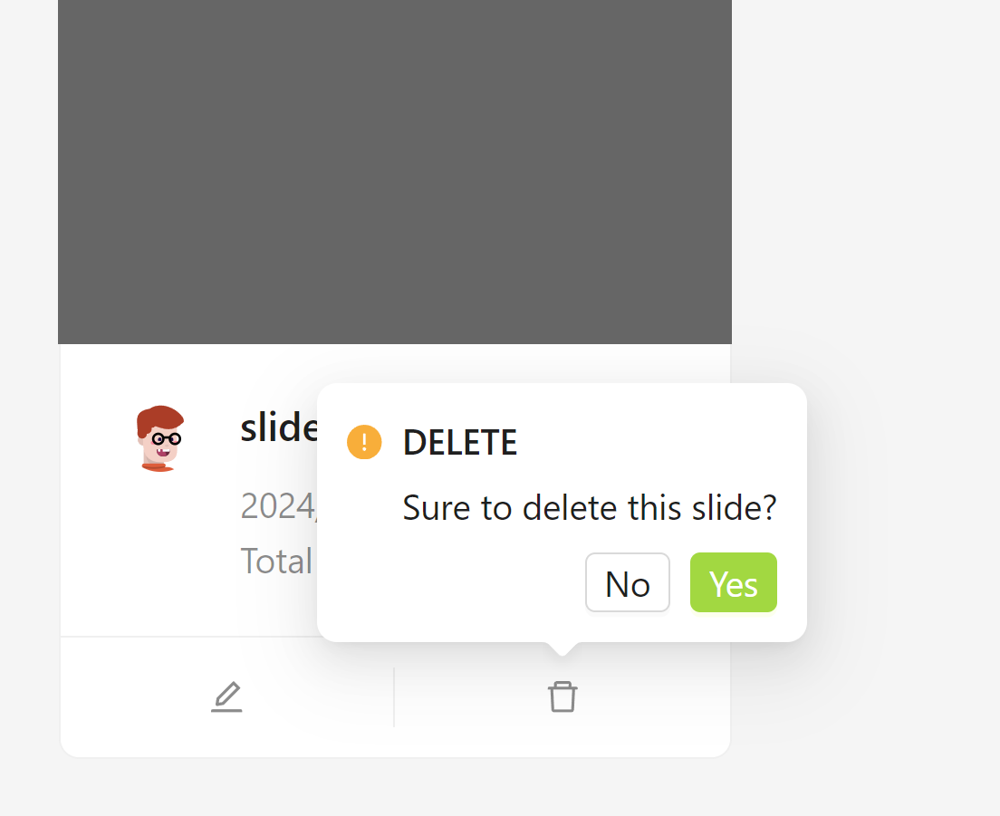

1. In the editing page, if the slide adopts the default title and subtitle template, users can also customize the font size of the title and subtitle. It also integrates relevant settings in the Design drawer component.
2. Encapsulated commonly used data requests and unified data access methods
3. The state management of the application adopts React hooks, combined with useContext and useReduce to achieve centralized state management similar to Redux, making data sharing and communication between components more convenient.
4. All important operations have a secondary confirmation pop-up window.

   
